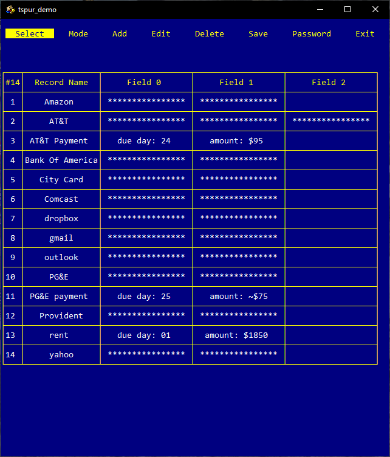
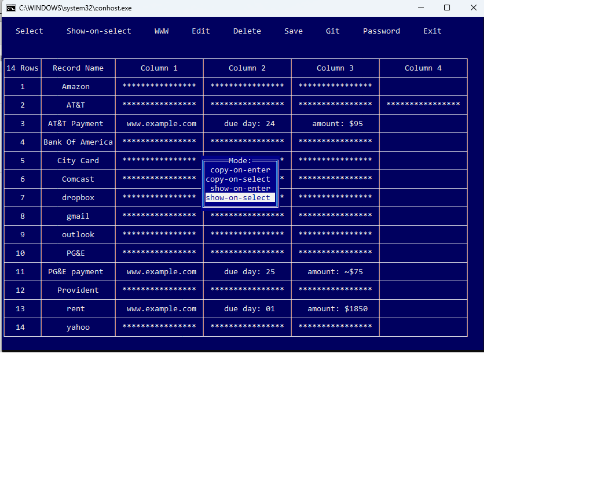
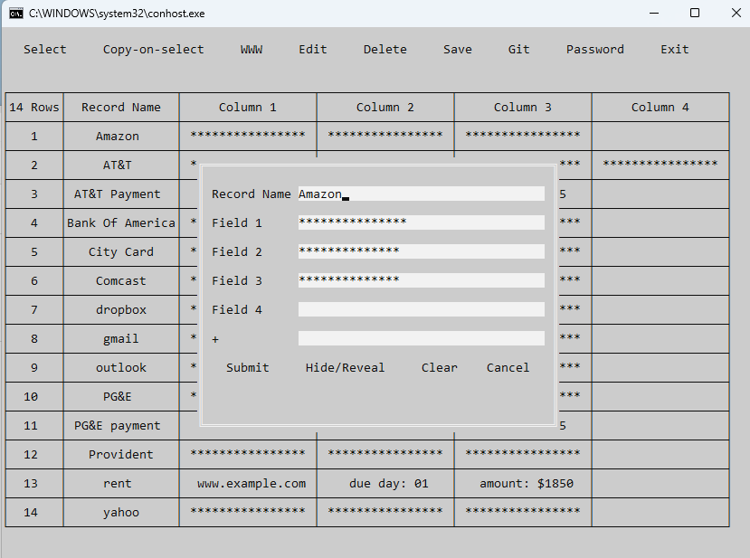

# tspur

TSPUR is the terminal application  with some user records presented as a table. I personally use it as cheat sheet (to keep my various usernames and passwords  together with some useful facts and reminders).

## General Description

Terminal screen consists of two areas:

* Top menu
* Table with User Records

Application starts with single argument: path to the file with data storage. Storage is encoded and password protected. If such a storage does not exists, application will ask you to enter the new password and  will create a new storage.

At start application puts focus on the top menu. Hitting "Enter", while button "Select" is in focus, move the focus to the table.  To put focus  back on the top menu use "Esc".To navigate through the menu or the table use arrow keys.

Number of table rows and columns is unlimited but it is unlikely somebody will use more than hundred rows or more then 3..5 columns. Each rows contains one cell (Record Name), which is always visible, and several values. Values on each row may be either all visible or all hidden.

## Application Modes

Application supports four modes:

* Clipboard-on-Enter. If user hits "Enter" on selected cell  its content is copied into clipboard.

* Clipboard-on-Select. During navigation content of selected cell is copied into clipboard.

* Visible-on-Enter. If user hits "Enter" on selected cell with hidden content it becomes visible.  When cell becomes unselected its contents becomes hidden again. 

* Visible-on-Select. If user selects cell with hidden content it becomes visible. When cell becomes unselected its contents becomes hidden again. 

## Entering the Data

User may add new records (button "Add") or edit existing (button "Edit"). To start edit existing record select it first, then by "Esc" go to the top menu and hit button "Edit". Record maybe extended with one extra value. If there is need to add several extra values repeat the process several times.

## Dependency

It is pure go application (no cgo needed). All the heavy lifting is done by three imported packages (and there dependencies):

	"github.com/rivo/tview"
	"github.com/gdamore/tcell"
	"github.com/atotto/clipboard"

(Code of this application is mostly tweaking around "tview" widgets.)

On Linux there is need to install "xclip", otherwise clipboard operations will not work.

## Platform Support

Code was developed on Windows 10. Linux (Ubuntu 18.04) seems to be OK (just don't forget to install "xclip").  For MAC code compiles but nobody tried it.

## Mouse Support

Package "tview" does not support mouse and the same is true about this application. 

## Demo
To run the demo:
* Clone the project from the Github: git clone https://github/jumbleview/tspur
* Move to the directory "tspur".
* Build executable: go build
* Move to the directory ../demo.
* Invoke either start.bat (Windows) or start.sh (Linux). As password enter word "password".

## Known problem

On Windows, if size of the terminal windows is changed dynamically (by dragging console corner with mouse, for example), structure of the table becomes broken. You can fix it by going back and force between top menu and the table.

