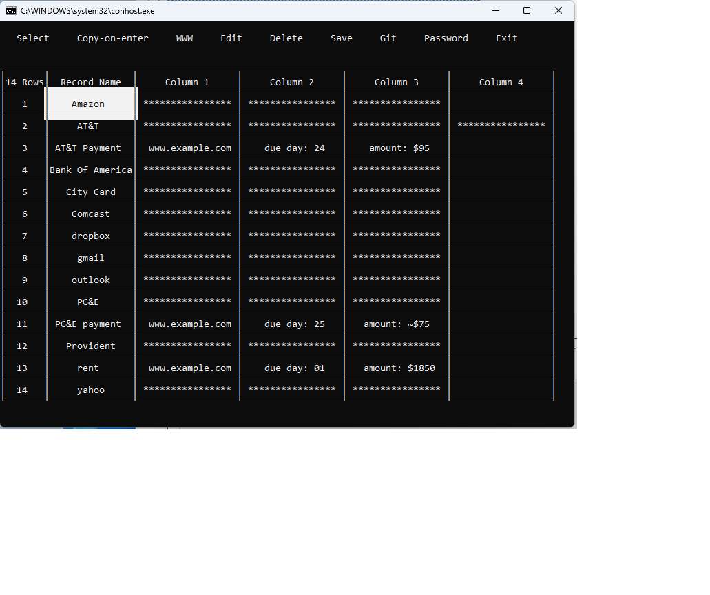

# tspur

TSPUR is terminal application  with some user records presented as a table. I personally use it as cheat sheet (to keep my various usernames and passwords  together with some useful facts and reminders).

## General Description
Terminal screen consists of two areas:
* Top menu
* Table with User Records

Application starts with some optional flags and single argument: path to the data storage file. Storage is encoded and password protected. If such a storage does not exists, application will ask you to enter the new password and  will create a new storage.

## Flags
Three flags defines color pallette at the application start. Color values are strings taken from map ColorNames in file color.go of packag tcell (https://github.com/gdamore/tcell/blob/main/color.go).

* Flag -cm  ( Colors Main ). It is comma separated list of two elements: color of the table font and color of the table background.

* Flag -cf  ( Colors of forms). It is comma separated list of three elements: color of the forms font, color of the form background, and color of the background of forms input fields.

* Flag -ct (Color trace). Color of font which denotes cells choosen by Enter key duirng current session.

Two more flags  define mode in which tool operates and some table transformation at start of applicatoin

* Flag -md (Mode). It defines mode with which application starts. (See section "Button with Application Modes")

* Flag -ta (Table altering). It is integer number. It defines if new column needs to be inserted  at start and in wich place. If negative,it denotes which column to delete.

At start application puts focus on the first row, first cell of the table.  To navigate through the table use arrow keys or make mouse clicks on table cells. When table is in focus you may select current row by hitting letter button which corresponds to the letter from which record name starts.  To put focus   on the top menu use "Esc" key or click any menu button by mouse. Hitting "Enter", while button "Select" is in focus, move the focus back to the table. 

Number of table rows and columns is unlimited but it is unlikely somebody will use more than hundred rows or more then 4..5 columns. Each row contains one always visible cell (Record Name) and several values. Values on each row may be either all visible or all hidden.

## Top Menu Button Functions

### Button Select
Hitting this button move focus to the table area

### Button with Application Modes

Application supports four modes:

* Clipboard-on-Enter. If user hits "Enter" on selected cell  its content is copied into clipboard.

* Clipboard-on-Select. During navigation content of selected cell is copied into clipboard.

* Visible-on-Enter. If user hits "Enter" on selected cell with hidden content it becomes visible.  When cell becomes unselected its contents becomes hidden again. 

* Visible-on-Select. If user selects cell with hidden content it becomes visible. When cell becomes unselected its contents becomes hidden again. 

### Button WWW
This button treats content of the table active cell as URL and propose to open browser window on that URL.   

### Button Edit

To edit existing record select record on the table, then by "Esc" go to the top menu and hit button "Edit". Edit form  apears on the screen. Record may be extended with one extra value. If there is need to add several extra values repeat the process several times. To add new record use button "Edit" and change key value. Edit form allows to change visiblity of the values wthbutton Hide/Reveal.

### Delete
Button proposes to delete table record with current active cell

### Save
Buton saves modified content of the table on the disk

### Git

Optional and limited integration with Git does exists. It provides chain git operations on modified encoded storage, namely:
* At Start "tspur" checks if storage lays in the directory with valid git working tree.
* If above is "true" button "Git" included in to the top menu.
* That button triggers chain if git actions, namely: it stages storage file, commit, and push commit result to remote.

Integration does not use any Go git package, just invokes consol operation of  "git" commands. Setting the account with Git provider, creating remote directory (most likely private) etc. is out of scope for this application.

## Dependencies
It is pure Go application (no cgo needed). All heavy lifting is done by three imported packages (and their dependencies):

	"github.com/rivo/tview"
	"github.com/gdamore/tcell/v2"
	"github.com/atotto/clipboard"

(Code of this application is mostly tweaking around "tview" widgets.)

On Linux there is need to install "xclip", otherwise clipboard operations will not work.

## Platform Support
Code was developed on Windows 10. On Windows 11 it wokrs. Consider uisng conhost instead  of default windows 
terminal.  Linux (Ubuntu 18.04) seems to be OK (just don't forget to install "xclip").  For MAC code compiles but nobody tried it.

## Demo
To build executable and run the demo:
* Go compiler must be installed. (Application was developed with Go 1.14. Early version may be OK as well).
* Clone the project from the Github: git clone https://github/jumbleview/tspur
* Go to the directory "tspur".
* Build the executable: go build
* Go to the directory ../demo.
* Invoke either start.bat (Windows) or start.sh (Linux). As the password enter word "password".

## Known problem
On Windows, if size of the terminal windows is changed dynamically (by dragging console corner with mouse, for example), structure of the table becomes broken. You can fix it by going back and force between top menu and the table.
